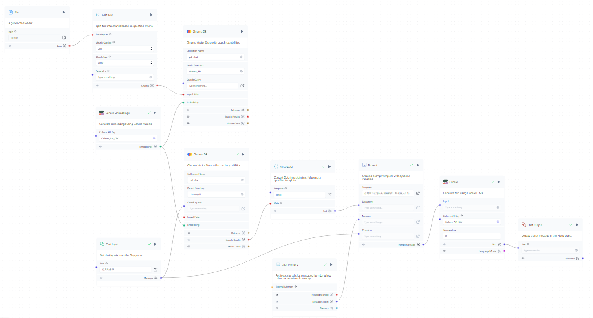
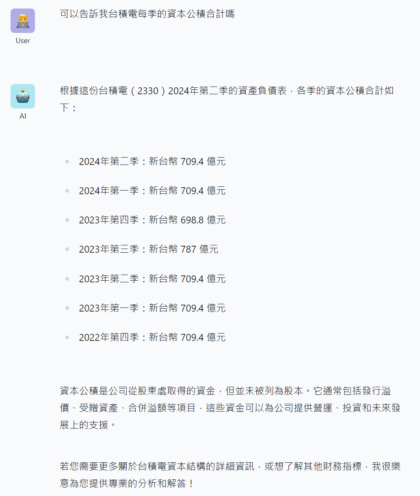
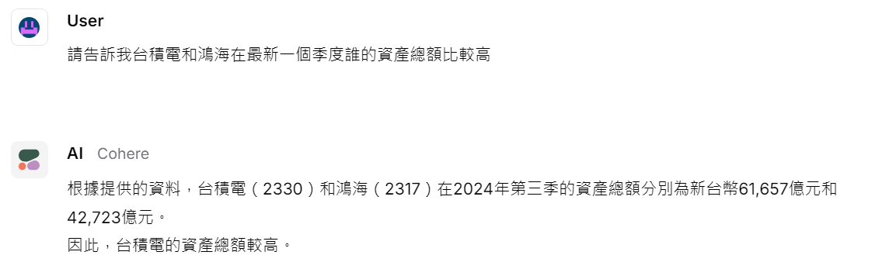

# Financial Statement Analysis Agent
用 langflow 做一個財報分析的聊天機器人，可以根據用戶的問題提取財務數據，以進行深入的財務報表分析。

## 2024/10/08

### 資料來源
- 公開資訊觀測站 (https://mops.twse.com.tw/mops/web/t57sb01_q1)

### 目前進度
1. 手動從公開資訊觀測站下載資料後，使用 main.py 將 pdf 文件中的文字和圖片資料提取至 txt
2. 在 langflow 上將加載的文本分割，並 Embeddings 轉換成數學向量後，儲存到 Chroma DB
3. 接收用戶輸入的查詢或問題，從存儲的向量中進行查詢操作，再將 Cohere 生成的回應顯示給用戶

### 測試結果

### 未來展望
1. 將 main.py 整合到 langflow 上
2. 將手動下載改成可以直接在網路上抓資料

## 2024/10/29

### 資料來源
- 台灣股市資訊網 (https://goodinfo.tw/tw/StockFinDetail.asp?RPT_CAT=BS_M_QUAR&STOCK_ID=2330)

### 目前進度
1. 從 chat input 的問題中，用 Cohere 得到想查詢的股票代碼，並得到網頁 URL
2. 用 Firecrawl Scrape API 抓取網頁資料，並用 Custom Component: Delimited Text Extractor 擷取需要的部分

### 測試結果

### 未來展望
1. 增加分析目標
    - 比率分析：闡釋公司關鍵財務比率及其意義
    - 趨勢分析：縱向分析公司的歷史表現
    - 橫向分析：跨時期、行業的對比
2. 優化模型
    - 修改 prompt 內容和各個參數

## 2024/11/12

### 目前進度
1. 將問題拆解成三個具體的步驟，如果有多項內容則以 ", " 隔開
   - 取得股票代碼，例如：2330, 2317
   - 查詢季度，例如：2024Q2
   - 查詢科目，例如：資產總額
2. 使用股票代碼分別取得資產負債表做兩家公司的比較
3. FirecrawlScrapeApi 在這次更新後出現 bug，暫時以 text input 的方式取代
4. 測試發現不使用 Chroma DB 的正確率比較高，可能是因為在文本分割時會將標題和內容分開而導致

### 測試結果
1. 橫向分析
    - 使用 Chroma DB -> 部分內容錯誤
      
      

    - 不使用 Chroma DB -> 內容正確
      
      
2. 趨勢分析
   - 不使用 Chroma DB -> 部分內容錯誤
     
     

### 未來展望
1. 解決 FirecrawlScrapeApi 的使用問題
2. 使用查詢季度和查詢科目做進一步的資料處理及 Prompt 優化

## 2024/11/21

### 目前進度
1. 刪除 chroma db
2. FirecrawlScrapeApi 的使用問題解決
3. 使用查詢季度和查詢科目做進一步的資料處理，只保留金額資料
4. 目前可以做到兩家公司在多個季度以及多個科目的比較

### 測試結果
1. 表格內資料測試 -> 內容正確

    
2. 指標分析 -> 內容錯誤

    

### 未來展望
1. 增加其他表格的讀取
2. 優化 Prompt

## 2024/11/26

### 目前進度
1. 將 FirecrawlScrapeApi 的部分改為用 custom component 爬蟲
    - 保留金額資料、查詢季度、和完整科目
2. 可以根據問題搜尋不同的財務報表
    - 資產負債表
    - 損益表
    - 現金流量表
    - 財務比率表
3. 可以搜尋多個季度（年度）和多個公司的結果
4. 在 Prompt 增加現在時間

### 測試結果
1. 表格內資料測試 -> 內容正確

    
2. 指標分析 -> 內容正確

    

### 未來展望
1. 回答增加圖表呈現

## 2024/11/30

### 目前進度
1. 增加一個 cohere component 分析前面獲得的文字，並根據資料內容輸出 chart.js 文字
   - 這個部分可能會因為輸出格式錯誤，導致無法使用 quickchart.io
2. 使用 quickchart.io 將文字繪製成圖表，並使用 Base64 編碼輸出
3. 在 chat output 的地方將 Base64 編碼用 markdown 格式輸出
4. 刪除 chat memory 中的圖表 markdown，避免 memory 內容過長

### 測試結果
1. 判斷不需要圖表

    
2. 繪製折線圖

    
3. 繪製圓餅圖

    

### 未來展望
1. 模型落地化
2. 圖表內容可以再調整

## 2024/12/30

### 目前進度
1. 將爬蟲前的問題分析拆解為四個部分 (llama3:latest)
    - 分析目標公司，ex: 台積電、鴻海
    - 分析財報時間範圍，ex: 單季
    - 分析財報類型，ex: 資產負債表
    - 分析年份或季度，ex: 2024Q3、2023Q3
2. 將爬蟲完的資料根據使用者問題再篩選一次
    - 留下含有問題中至少兩個字，且首位為數字(標題)或問題中的字(資料)的行
3. 使用篩選完的資料回答問題 (llama3.2:latest)
4. 使用回答的內容繪製圖表 (llama3.2:latest)

### 測試結果
(每次測試均先清空記憶、暫不考慮圖表部分)

1. 指定財報 -> 數據正確、部分敘述錯誤

    
2. 不指定財報 -> 數據正確

    
3. 多個公司、季度 -> 大部分數據錯誤

    
4. 記憶內容 -> 數據正確、部分敘述錯誤

    
5. 現在時間 -> 提示後大部分內容正確

    
6. 會計科目 -> 大部分數據正確、沒有提問中未提到的科目資料

    

### 未來展望
1. 提高正確率
2. 圖表調整

## 2025/01/18
### 目前進度
1. 支援中、英文等語言
2. 改用 yfinance api 獲得資料
    - goodinfo 只有台股的資料，但可以選擇查詢的具體年份或季度
    - yfinance 有美股、台股等資料，但只能查詢近期年份或季度
3. 增加思考過程，提高正確率
    - 加入問題分析和答案驗證
4. 所有 model 均使用 llama3:latest

### 測試結果
1. 回答問題 -> 正確回答

    
2. 計算比率 -> 數據正確、計算部分錯誤

    
3. 多家公司 -> 台股股票代號錯誤，需要另外提示

    
4. 圖表繪製 -> 正確繪製

    

### 未來展望
1. 提高正確率
