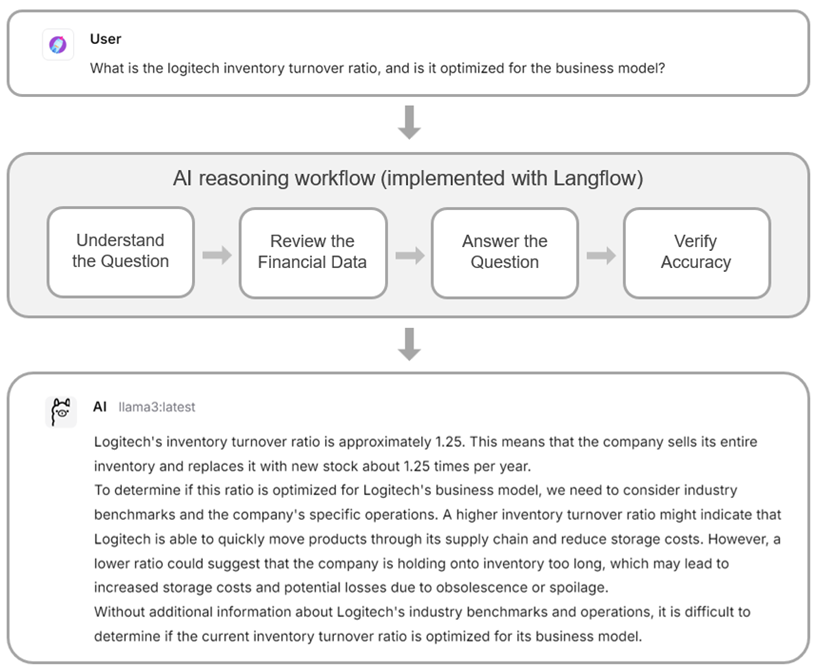

# Langflow-Based Financial Statement Analysis Agent

**學校：** 國立陽明交通大學 資訊工程學系  
**課程：** 資訊工程專題（一）  
**學生：** 趙堉安  
**指導教授：** 陳添福 教授  
**日期：** 中華民國114年01月

## 動機與目的
財務數據種類繁多且資料量大，涵蓋公司資產負債表、損益表、現金流量表等多個面向。手動分析不僅耗時，還容易出現錯誤或遺漏。對投資者而言，快速萃取關鍵資訊以做出正確判斷是一項極具挑戰的任務。  

本專題基於 Langflow 框架，開發一個財報分析系統，能：
- 根據使用者提出的問題，自動透過 **yfinance API** 提取財務數據。
- 結合 **llama3:latest 模型** 進行落地化推論。
- 採用結構化思考步驟，提升回答的正確性。
- 生成完整的財務報表分析結果，並搭配 **quickchart.io** 繪製圖表。

系統目標是為投資者提供簡單、快速且可靠的財報分析，協助其做出更明智的投資決策。

## 系統架構與流程設計
系統整體流程可分為三個主要部分：

### 1. 使用者問題輸入與解析
- 使用者透過介面提出財務分析問題。
- 系統結合歷史記錄與當前時間進行語意解析。
- 會自動補充前次分析背景，將省略問題轉化為完整指令。  

**範例**：
> 上一輪問：「公司負債比率近三年的變化趨勢？」  
> 下一輪只問：「股東權益報酬率呢？」  
> 系統仍能理解完整問題意圖。

### 2. 財務資料抓取與預整理
- 系統自動識別公司及股票代碼，確認需要使用的財務報表類型（資產負債表、損益表、現金流量表）。
- 透過 **yfinance API** 抓取財務報表，挑選與問題相關的會計科目。
- 減少不相關資料干擾，提升分析效率與正確性。  

**範例**：
> 問：「請問近三年台積電的負債總額與股東權益的變化情況？」  
> 系統抓取近三年的年度資產負債表，並挑選「負債」與「股東權益」科目。

### 3. 財務分析、回答生成與結果檢查
- 將使用者問題與相關財務數據輸入模型進行推論。
- 回答中展現清晰思考步驟，協助使用者理解分析過程。
- 根據問題特性決定是否生成 **quickchart.io** 圖表（折線圖、直方圖）。
- 最終整合文字分析與圖表呈現，回饋給使用者作為投資決策參考。

## 成果評估
- 以多個財務分析問題進行測試，約 **七成以上問題生成正確分析結果**（部分計算仍有輕微誤差）。
- 系統可提供具有參考價值的財務見解。
- 仍存在部分問題未達預期，例如：
  - 未找到會計科目
  - 股票代號錯誤
  - 圖表生成問題  

**範例**：
> 問：「請分析蘋果近幾年的毛利率變化趨勢」  
> 系統僅能採用估算方式呈現，圖表標籤出現錯誤。
> 

## 結論
本專題成功開發了基於 Langflow 的財報分析系統，具備以下功能：
- 自動抓取公司財務數據
- 結合 **llama3:latest 模型** 生成文字分析與圖表
- 採用結構化思考步驟，提供大部分案例正確且有參考價值的分析結果
- 有效提升財務分析效率與準確性

**未來優化方向**：
- 加強資料驗證機制
- 優化語意解析模型
- 改進圖表生成流程  

隨著模型與資料源的持續優化，系統有望提供更全面的財務分析服務，幫助使用者快速掌握財務狀況，降低分析成本，並提升投資或決策效率與準確性。

## 資料來源
- [Langflow 官方網站](https://www.langflow.org/)
- [LLaMA3 模型介紹](https://ollama.com/library/llama3)
- [yfinance Python API 文件](https://ranaroussi.github.io/yfinance/index.html)
- [Goodinfo 台灣股市資訊](https://goodinfo.tw/tw/StockFinDetail.asp)
- [QuickChart 圖表生成工具](https://quickchart.io/)
